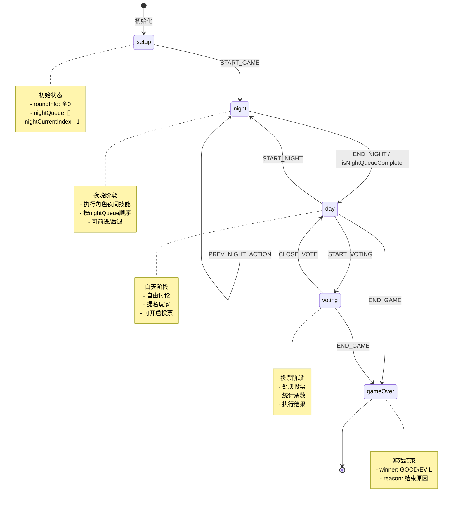

# Phase Machine 状态图可视化

## 概述

`phaseMachine` 是用于管理游戏阶段流转的XState v5状态机，包含5个主要状态和多个转换事件。

## 状态机架构

### 状态（States）

1. **setup** - 初始设置状态
2. **night** - 夜晚阶段（执行角色技能）
3. **day** - 白天阶段（讨论和提名）
4. **voting** - 投票阶段（处决投票）
5. **gameOver** - 游戏结束（终态）

### 事件（Events）

- `START_GAME` - 开始游戏
- `NEXT_NIGHT_ACTION` - 下一个夜间行动
- `PREV_NIGHT_ACTION` - 上一个夜间行动
- `END_NIGHT` - 结束夜晚
- `START_NIGHT` - 开始新的夜晚
- `START_VOTING` - 开始投票
- `CLOSE_VOTE` - 关闭投票
- `END_GAME` - 结束游戏

## Mermaid 状态图



## 详细状态转换

### 1. setup → night (START_GAME)

**触发条件**：
- 用户点击"开始游戏"

**Actions**：
- `initializeGame`: 初始化游戏状态
  - 设置 `roundInfo.nightCount = 1`
  - 设置 `roundInfo.totalRounds = 1`
  - 计算第一夜的 `nightQueue`
  - 设置 `nightCurrentIndex = -1`
  - 保存座位信息

**Context变化**：
```typescript
// 前
{ roundInfo: { dayCount: 0, nightCount: 0, ... }, nightQueue: [], seats: [] }

// 后
{ roundInfo: { dayCount: 0, nightCount: 1, totalRounds: 1, ... },
  nightQueue: ['imp', 'washerwoman', 'empath'],
  seats: [...] }
```

### 2. night → day (自动转换)

**触发条件**：
- Always guard: `isNightQueueComplete` 返回 true
- 或手动触发 `END_NIGHT`

**Guard条件**：
```typescript
isNightQueueComplete: nightCurrentIndex + 1 >= nightQueue.length
```

**Actions**：
- `startDayPhase`: 开始白天
  - `roundInfo.dayCount++`
  - `roundInfo.totalRounds++`
  - `nightCurrentIndex = -1`

### 3. night 内部循环 (NEXT_NIGHT_ACTION)

**触发条件**：
- 说书人点击"下一个"

**Actions**：
- `advanceNightAction`: 前进索引
  - `nightCurrentIndex++`

**流程**：
```
nightCurrentIndex: -1 → 0 → 1 → 2 → ... → (length-1) → [转换到day]
```

### 4. night 内部回退 (PREV_NIGHT_ACTION)

**触发条件**：
- 说书人点击"上一个"

**Guard条件**：
```typescript
canGoBackInNightQueue: nightCurrentIndex > 0
```

**Actions**：
- `rewindNightAction`: 回退索引
  - `nightCurrentIndex--`

### 5. day → voting (START_VOTING)

**触发条件**：
- 玩家被提名，开启投票

**Guard条件**：
```typescript
canStartVoting: !gameOver
```

**Event payload**：
```typescript
{ type: 'START_VOTING', nomineeSeatId: number }
```

### 6. day → night (START_NIGHT)

**触发条件**：
- 说书人宣布夜晚降临

**Actions**：
- `startNightPhase`: 开始新夜晚
  - `roundInfo.nightCount++`
  - `roundInfo.totalRounds++`
  - 计算新的 `nightQueue`（非首夜）
  - `nightCurrentIndex = -1`

### 7. voting → day (CLOSE_VOTE)

**触发条件**：
- 投票结束

**Event payload**：
```typescript
{ type: 'CLOSE_VOTE', isExecuted: boolean }
```

### 8. day/voting → gameOver (END_GAME)

**触发条件**：
- 游戏结束条件满足

**Actions**：
- `endGame`: 设置游戏结束
  - `gameOver = { isOver: true, winner, reason }`

**Event payload**：
```typescript
{ type: 'END_GAME', winner: 'GOOD' | 'EVIL', reason: string }
```

## 上下文（Context）结构

```typescript
interface PhaseMachineContext {
  roundInfo: {
    dayCount: number;        // 白天轮次数
    nightCount: number;      // 夜晚轮次数
    nominationCount: number; // 提名计数
    totalRounds: number;     // 总轮次数
  };
  nightQueue: string[];      // 夜间行动队列（roleId数组）
  nightCurrentIndex: number; // 当前夜间行动索引（-1表示未开始）
  seats: Seat[];            // 座位信息
  gameOver: {               // 游戏结束信息
    isOver: boolean;
    winner: Team;
    reason: string;
  } | null;
}
```

## Guards（守卫）

| Guard | 描述 | 条件 |
|-------|------|------|
| `isNightQueueComplete` | 夜间队列是否完成 | `nightCurrentIndex + 1 >= nightQueue.length` |
| `canStartVoting` | 是否可以开始投票 | `!gameOver` |
| `canGoBackInNightQueue` | 是否可以回退 | `nightCurrentIndex > 0` |

## Actions（动作）

| Action | 描述 | Context变化 |
|--------|------|-------------|
| `initializeGame` | 初始化游戏 | 设置roundInfo、nightQueue、seats |
| `startNightPhase` | 开始夜晚 | nightCount++, totalRounds++, 重新计算queue |
| `startDayPhase` | 开始白天 | dayCount++, totalRounds++, 重置index |
| `advanceNightAction` | 前进夜间行动 | nightCurrentIndex++ |
| `rewindNightAction` | 回退夜间行动 | nightCurrentIndex-- |
| `endGame` | 结束游戏 | 设置gameOver信息 |

## 典型流程示例

### 完整游戏流程

```
1. setup (初始)
   ↓ START_GAME
2. night (第1夜)
   - nightCurrentIndex: -1 → 0 → 1 → 2
   ↓ 自动转换 (isNightQueueComplete)
3. day (第1天)
   ↓ START_VOTING
4. voting (投票)
   ↓ CLOSE_VOTE
5. day (返回讨论)
   ↓ START_NIGHT
6. night (第2夜)
   ↓ END_NIGHT
7. day (第2天)
   ↓ END_GAME
8. gameOver (终态)
```

### 夜间队列详细流程

假设 `nightQueue = ['imp', 'washerwoman', 'empath']`：

```
State: night
nightCurrentIndex: -1 (初始)

→ NEXT_NIGHT_ACTION
nightCurrentIndex: 0 (显示 imp 的提示)

→ NEXT_NIGHT_ACTION
nightCurrentIndex: 1 (显示 washerwoman 的提示)

→ NEXT_NIGHT_ACTION
nightCurrentIndex: 2 (显示 empath 的提示)

→ NEXT_NIGHT_ACTION
isNightQueueComplete = true (2 + 1 >= 3)
→ 自动转换到 day
```

## 与 Zustand 集成

状态机通过 `phaseMachine` slice 集成到 Zustand：

```typescript
// 初始化
store.initializePhaseMachine();

// 订阅状态变化
store.phaseState // 'setup' | 'night' | 'day' | 'voting' | 'gameOver'
store.phaseContext // PhaseMachineContext

// 发送事件
store.phaseMachine.startGame(seats);
store.phaseMachine.nextNightAction();
store.phaseMachine.endNight();
```

## 测试覆盖

- ✅ 状态机核心测试：27/27 通过
- ✅ Zustand集成测试：13/13 通过
- ✅ 覆盖率：100%（guards + actions + transitions）

## 可视化工具

### 在线可视化

访问 [XState Visualizer](https://stately.ai/viz) 并粘贴 `phaseMachine` 的代码可以看到交互式状态图。

### 本地可视化（可选）

```bash
# 安装 @xstate/cli
npm install -D @xstate/cli

# 生成状态图
npx xstate-cli src/lib/machines/phaseMachine.ts --output docs/phase-machine.png
```

## 优势总结

1. **清晰的状态管理**：5个明确的状态，避免隐式状态组合
2. **类型安全**：完整的TypeScript类型支持
3. **可测试**：guards和actions独立可测
4. **可视化**：状态转换一目了然
5. **可维护**：新增状态/事件容易扩展
6. **自文档化**：代码即文档

## 后续优化方向

1. **持久化**：状态机快照可序列化存储
2. **历史记录**：XState内置历史状态支持回退
3. **并行状态**：支持同时进行的子流程
4. **延时转换**：自动超时机制
5. **Actor模型**：多状态机通信
