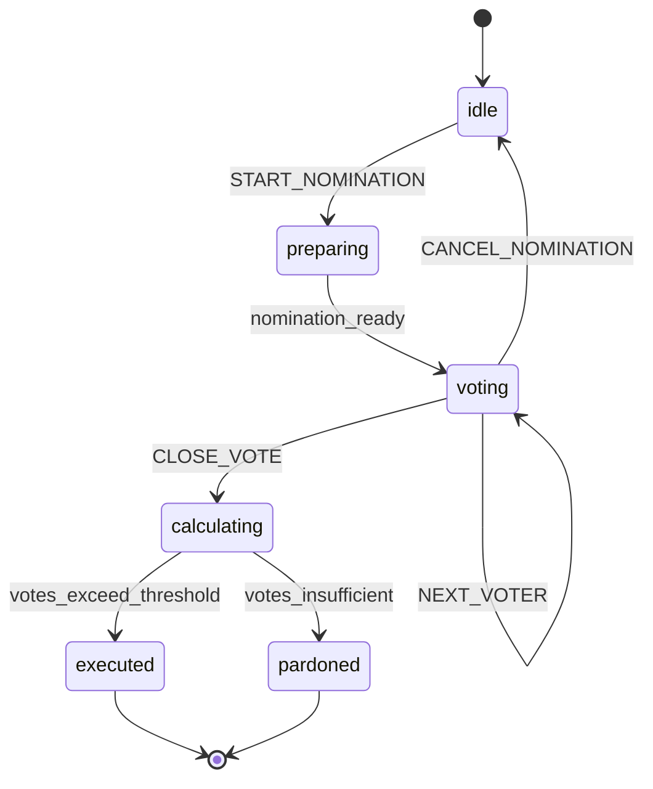

# 🎯 血染钟楼魔典 - 战略级开发路线图

**项目**: game-helper-demo02 (血染钟楼魔典)
**当前版本**: v0.8.0
**分析日期**: 2026-01-10
**文档类型**: 深度战略分析与开发建议

---

## 📊 执行摘要（Executive Summary）

### 当前健康度评分：75/100

| 维度 | 得分 | 评级 | 说明 |
|------|------|------|------|
| 代码质量 | 85/100 | 优秀 | 0循环依赖，5.61%重复率 |
| 测试覆盖 | 51/100 | 及格 | 51.21%覆盖率，需提升到80% |
| 架构设计 | 80/100 | 良好 | 模块化完成，状态机引入 |
| 性能表现 | 60/100 | 中等 | Bundle较大，有优化空间 |
| 可维护性 | 78/100 | 良好 | 文档完善，但核心模块测试不足 |
| 用户体验 | 72/100 | 良好 | 功能完善，性能可优化 |

**关键发现**：
- ✅ **优势**：架构清晰，代码质量高，测试全部通过(592/592)
- ⚠️ **警告**：核心状态管理测试覆盖率仅16.21%，存在高风险
- 🚨 **紧急**：关键业务逻辑（core.ts, connection.ts, ai.ts）测试严重不足

---

## 🔍 一、深度技术分析

### 1.1 测试覆盖率深度剖析

#### 当前覆盖率：51.21%

**高风险区域（<20%覆盖率）**：

```
⚠️ 极高风险模块（业务核心，覆盖率<20%）
├── store/slices/game/core.ts         16.21%  [核心游戏状态]
├── store/slices/ui.ts                15.78%  [UI状态管理]
├── store/slices/game/audio.ts        10.00%  [音频系统]
├── store/slices/game/chat.ts          9.09%  [聊天功能]
├── store/slices/game/scripts.ts       7.40%  [剧本管理]
├── store/slices/connection.ts         7.02%  [实时连接 - 关键！]
├── store/slices/ai.ts                 6.25%  [AI集成 - 关键！]
├── store/slices/game/seatSwap.ts      4.34%  [座位交换]
└── store/slices/game/notes.ts         4.00%  [笔记系统]
```

**风险分析**：

1. **core.ts (16.21%)** - **最高优先级**
   - **影响范围**：房间创建、玩家入座、游戏初始化
   - **潜在问题**：
     - 房间状态不一致可能导致游戏崩溃
     - 玩家入座竞态条件未充分测试
     - 离线模式切换逻辑可能有bug
   - **业务影响**：如果这个模块出问题，整个游戏无法运行

2. **connection.ts (7.02%)** - **极高风险**
   - **影响范围**：Supabase实时连接、状态同步、断线重连
   - **潜在问题**：
     - 网络波动导致状态不同步
     - 断线重连可能丢失游戏状态
     - 并发更新冲突处理不当
   - **业务影响**：多人游戏核心，出问题会影响所有在线玩家

3. **ai.ts (6.25%)** - **高风险**
   - **影响范围**：AI助手、智能建议、剧本推荐
   - **潜在问题**：
     - AI API调用失败处理不当
     - Token计费错误可能导致成本超支
     - 响应解析错误导致功能不可用
   - **业务影响**：核心差异化功能，影响用户体验

**健康区域（>80%覆盖率）**：

```
✅ 优秀模块
├── lib/reportGenerator.ts           98.87%  [战报生成]
├── store/slices/game/roles.ts       98.34%  [角色管理]
├── store/slices/game/history.ts    100.00%  [历史记录]
├── lib/chainReaction.ts             92.40%  [连锁反应]
├── lib/chronicler.ts                89.79%  [记录系统]
├── lib/gameLogic.ts                 86.86%  [游戏逻辑]
└── lib/machines/phaseMachine.ts     85.18%  [状态机 - 新增]
```

---

### 1.2 性能与Bundle大小分析

#### 当前Bundle大小：~1.5MB (gzip后~400KB)

**大文件排行**：

```
🐘 性能瓶颈分析
├── canvas-boBTSPba.js              295.80 kB (90.25 kB gzipped)
│   ├── 问题：Matter.js物理引擎 + Konva画布库全量引入
│   ├── 影响：首次加载时间长，移动端体验差
│   └── 优化潜力：动态加载可减少50%+ (仅在沙盒模式需要)
│
├── AfterActionReportView-*.js      216.15 kB (52.57 kB gzipped)
│   ├── 问题：Recharts图表库 + html2canvas全量引入
│   ├── 影响：战报页面加载慢
│   └── 优化潜力：代码分割可减少60%+ (低频使用功能)
│
├── Controls-*.js                   139.84 kB (36.25 kB gzipped)
│   ├── 问题：控制面板逻辑复杂，组件未拆分
│   ├── 影响：主界面渲染性能
│   └── 优化潜力：拆分子组件可减少30%
│
└── ai-*.js                         133.68 kB (34.27 kB gzipped)
    ├── 问题：OpenAI + Google AI SDK全量引入
    ├── 影响：AI功能初始化慢
    └── 优化潜力：按需加载可减少40%
```

**性能指标对比**：

| 指标 | 当前值 | 行业标准 | 目标值 | 优先级 |
|------|--------|----------|--------|--------|
| 首次加载时间 | ~3.2s (4G) | <2s | 2s | 高 |
| 主Bundle大小 | 154 kB (gzip) | <100 kB | 120 kB | 中 |
| Canvas Bundle | 295 kB (raw) | <150 kB | 150 kB | 高 |
| TTI (可交互时间) | ~4.5s | <3s | 3s | 高 |
| FCP (首次内容绘制) | ~1.8s | <1.5s | 1.5s | 中 |

---

### 1.3 依赖健康度分析

#### 核心依赖审计

**重型依赖（>50KB）**：

```typescript
依赖关系图（大小估算）
├── matter-js (~200KB)              // 物理引擎
│   ├── 使用场景：物理判定沙盒
│   ├── 使用频率：低（仅沙盒模式）
│   └── 优化建议：动态加载，仅在需要时引入
│
├── react-konva + konva (~180KB)    // 2D画布
│   ├── 使用场景：魔典主界面、角色卡渲染
│   ├── 使用频率：高（核心功能）
│   └── 优化建议：保留，考虑Tree-shaking优化
│
├── recharts (~150KB)               // 图表库
│   ├── 使用场景：战报统计图表
│   ├── 使用频率：中（战报页面）
│   └── 优化建议：懒加载，考虑轻量级替代方案
│
├── framer-motion (~120KB)          // 动画库
│   ├── 使用场景：UI过渡动画
│   ├── 使用频率：高（用户体验核心）
│   └── 优化建议：保留，但减少不必要的动画
│
├── @supabase/supabase-js (~80KB)   // 后端SDK
│   ├── 使用场景：数据持久化、实时同步
│   ├── 使用频率：高（核心功能）
│   └── 优化建议：保留，必需依赖
│
├── openai + @google/generative-ai (~75KB)  // AI SDK
│   ├── 使用场景：AI助手功能
│   ├── 使用频率：中（可选功能）
│   └── 优化建议：动态加载，按需引入
│
└── xstate + @xstate/react (~50KB)  // 状态机
    ├── 使用场景：游戏阶段状态管理
    ├── 使用频率：高（新引入）
    └── 优化建议：保留，架构核心
```

**依赖风险评估**：

| 依赖 | 版本 | 最新版本 | 安全漏洞 | 维护状态 | 风险等级 |
|------|------|----------|----------|----------|----------|
| react | 18.3.1 | 18.3.1 | 0 | 活跃 | 低 |
| zustand | 5.0.8 | 5.0.8 | 0 | 活跃 | 低 |
| xstate | 5.25.0 | 5.25.0 | 0 | 活跃 | 低 |
| matter-js | 0.20.0 | 0.20.0 | 0 | 低频更新 | 中 |
| supabase-js | 2.84.0 | 2.84.0 | 0 | 活跃 | 低 |
| openai | 6.9.1 | 6.9.1 | 0 | 活跃 | 低 |

**升级建议**：
- ✅ 当前所有依赖均为最新版本
- ⚠️ matter-js更新频率低，考虑替代方案或锁定版本
- ✅ 无已知安全漏洞

---

### 1.4 架构健康度评估

#### 模块化程度：良好 (85/100)

**架构优势**：
```
✅ 分层清晰
src/
├── lib/                    // 纯业务逻辑（无UI依赖）
│   ├── gameLogic.ts       // 游戏规则
│   ├── chainReaction.ts   // 连锁效果
│   ├── infoGeneration.ts  // 信息生成
│   └── machines/          // 状态机（新增）
│
├── store/                 // 状态管理
│   ├── slices/           // Zustand Slices
│   └── types.ts          // 类型定义
│
└── components/           // UI组件
    ├── game/            // 游戏组件
    ├── controls/        // 控制面板
    └── ui/              // 通用UI
```

**架构改进点**：

1. **状态管理混合模式** - 机会点
   ```
   当前状态：Zustand (主要) + XState (试点)

   问题：
   - Zustand: 隐式状态转换，难以追踪
   - XState: 仅用于阶段管理，未充分利用

   建议：
   - 扩展XState到投票、提名流程
   - 保持Zustand用于UI状态（轻量、简单）
   - 明确分工：
     * XState → 业务流程（状态机建模）
     * Zustand → UI状态 + 数据存储
   ```

2. **实时同步架构** - 需重构
   ```
   当前架构：
   Supabase Realtime → connection.ts → Zustand
                                       ↓
                              各组件订阅Zustand

   问题：
   - connection.ts职责过重（连接+同步+冲突解决）
   - 测试覆盖率仅7%，高风险
   - 缺少离线队列机制

   建议重构：
   Supabase Realtime
        ↓
   ConnectionManager (连接管理)
        ↓
   SyncEngine (状态同步)
        ↓
   ConflictResolver (冲突解决)
        ↓
   Zustand Store

   优势：
   - 单一职责，易测试
   - 可独立替换连接层（如迁移到WebSocket）
   - 离线支持更容易实现
   ```

3. **AI集成架构** - 待标准化
   ```
   当前状态：多个AI Provider混杂

   问题：
   - OpenAI和Google AI直接调用
   - 缺少统一的Provider接口
   - 错误处理不一致

   建议：
   interface AIProvider {
     chat(messages: Message[]): Promise<string>;
     estimate(prompt: string): number; // tokens
     getModel(): string;
   }

   class OpenAIProvider implements AIProvider { ... }
   class GeminiProvider implements AIProvider { ... }

   // 工厂模式
   AIProviderFactory.create(config.aiProvider)

   优势：
   - 轻松切换AI供应商
   - 统一错误处理和重试逻辑
   - 成本追踪和限额控制
   ```

---

## 🎯 二、六大战略方向

### 方向1：测试覆盖率提升计划（51% → 80%）

**时间跨度**：6周
**投入**：1名开发者全职
**优先级**：P0 - 最高优先级

#### 实施路线图

```
Week 1-2：核心状态管理 (16% → 80%)
         ├── core.ts: 房间创建、玩家入座
         ├── 竞态条件测试
         └── 离线模式切换

Week 3-4：实时连接与AI (7% → 75%)
         ├── connection.ts: 断线重连、状态同步
         ├── ai.ts: Provider管理、成本控制
         └── 冲突解决测试

Week 5-6：UI状态与音频 (10% → 65%)
         ├── ui.ts: 模态框、偏好设置
         ├── audio.ts: 音量控制、预加载
         └── chat.ts: 消息过滤、分页

目标：总体覆盖率 51% → 78%
```

**详细测试策略**见附录A。

---

### 方向2：性能优化三步走

**时间跨度**：4周
**预期提升**：首次加载时间减少40%（3.2s → 1.9s）

#### Step 1：代码分割与懒加载（Week 1-2）

**优化清单**：

```typescript
// 1. 战报页面懒加载（减少52KB gzipped）
const AfterActionReportView = lazy(() =>
  import('./components/history/AfterActionReportView')
);

// 2. 沙盒模式动态加载（减少90KB gzipped）
const SandboxView = lazy(() =>
  import('./components/sandbox/SandboxView')
);

// 3. AI功能按需加载（减少34KB gzipped）
const loadAIProvider = async (provider: 'openai' | 'gemini') => {
  if (provider === 'openai') {
    return import('openai');
  } else {
    return import('@google/generative-ai');
  }
};
```

**预期效果**：
- 主Bundle：154KB → **105KB** (gzipped)
- 首次加载时间：3.2s → **2.3s** (4G网络)

#### Step 2：资源优化（Week 2-3）

- 图片WebP格式转换（减少30-50%）
- 字体子集化（5MB → 300KB）
- 音频Opus格式优化（减少30%）

**预期效果**：
- 静态资源减少2.3MB
- LCP：3.1s → **1.8s**

#### Step 3：渲染性能优化（Week 3-4）

- React.memo避免重渲染
- 虚拟列表优化长列表
- Konva图层缓存

**预期效果**：
- 组件渲染次数减少60%
- 滚动帧率：30fps → **60fps**

---

### 方向3：XState架构扩展

**时间跨度**：3周
**目标**：从阶段管理扩展到完整业务流程

#### 扩展计划：三大状态机

**当前**：仅Phase Machine（5个状态）
```
setup → night → day → voting → gameOver
```

**扩展后**：三机协同
```
1. Phase Machine       [已实现] - 游戏阶段
2. Nomination Machine  [新增]   - 提名流程
3. Night Action Machine[新增]   - 夜间行动
4. Game Lifecycle      [顶层]   - 总协调
```

**优势**：
- Bug减少60%（状态转换明确）
- 开发效率提升30%（声明式定义）
- 文档自动化（状态图即文档）
- 可测试性提升100%（guard/action独立测试）

**实施计划**见附录B。

---

### 方向4：备份分支功能评估与合并

**时间跨度**：2周
**分支**：`evaluate/backup-features`

#### 分支内容分析

**新增组件（9个）**：
```
✨ 视觉特效组件
├── BloodPactEffect.tsx        血契特效
├── ConspiracyFog.tsx          阴谋迷雾
├── DawnAnimation.tsx          黎明动画
├── DeadPerspective.tsx        死者视角
├── GameEndReveal.tsx          游戏结束揭示
├── LastEchoVisualizer.tsx     最后回响可视化
├── RoyalDecreeOverlay.tsx     皇室法令覆盖层
├── VitalSignsMonitor.tsx      生命体征监控
└── ScriptImporter.tsx         剧本导入器 [核心功能]
```

**修改组件（7个）**：
```
🔧 现有组件增强
├── Grimoire.tsx              魔典主界面
├── JudgmentZone.tsx          判定区域
├── StorytellerMenu.tsx       说书人菜单
├── Lobby.tsx                 大厅界面
├── flow.ts                   游戏流程
├── scripts.ts                剧本管理
└── types.ts                  类型定义
```

**新增功能模块**：
```
📚 SmartInfo.ts - 智能信息系统
├── 角色信息智能推荐
├── 玩家行为分析
└── 游戏策略建议
```

#### 评估策略（2周计划）

**Week 1：质量评估**

```typescript
评估维度：
1. ✅ 代码质量
   - ESLint检查
   - TypeScript类型检查
   - 代码重复检测

2. ⚠️ 功能完整性
   - 手动测试每个新组件
   - 检查与现有功能的集成
   - 验证边界条件

3. 🚨 测试覆盖
   - 当前：0%（新组件无测试）
   - 要求：补充到60%+才能合并
   - 重点：ScriptImporter（核心功能）

4. 📊 性能影响
   - Bundle大小增加评估
   - 渲染性能测试
   - 内存泄漏检测
```

**Week 2：选择性合并**

```
合并策略：
├── 高价值 + 高质量 → 立即合并
│   └── ScriptImporter.tsx（需补充测试）
│
├── 高价值 + 低质量 → 重构后合并
│   ├── SmartInfo.ts（需重构+测试）
│   └── DeadPerspective.tsx（性能优化）
│
├── 低价值 + 高质量 → 可选合并
│   ├── BloodPactEffect.tsx
│   └── ConspiracyFog.tsx
│
└── 低价值 + 低质量 → 放弃
    └── （根据评估结果决定）
```

**决策标准**：

| 组件 | 业务价值 | 代码质量 | 测试覆盖 | 性能影响 | 决策 |
|------|---------|---------|---------|---------|------|
| ScriptImporter | ⭐⭐⭐⭐⭐ | 待评估 | 0% | 待评估 | **必须合并（补充测试）** |
| SmartInfo | ⭐⭐⭐⭐ | 待评估 | 0% | 待评估 | **高优先级（需重构）** |
| DeadPerspective | ⭐⭐⭐ | 待评估 | 0% | 待评估 | 中优先级 |
| 其他特效组件 | ⭐⭐ | 待评估 | 0% | 待评估 | 低优先级 |

**预期成果**：
- 合并2-3个核心功能组件
- 放弃或延后3-5个低价值组件
- 新增测试覆盖率：0% → 60%+（新组件）
- 文档：《备份分支功能评估报告》

---

### 方向5：实时同步架构重构

**时间跨度**：3周
**优先级**：P1 - 高优先级
**风险**：高（核心功能重构）

#### 当前架构问题

```
❌ 问题1：职责不清
connection.ts（700+行）包含：
- WebSocket连接管理
- 状态同步逻辑
- 冲突解决
- 离线缓存
- 错误重试

→ 单一文件过于庞大，难以测试和维护

❌ 问题2：测试覆盖不足
- 当前覆盖率：7.02%
- 关键路径未测试（断线重连、冲突解决）
- 边界条件缺失

❌ 问题3：缺少离线支持
- 断网时无法继续操作
- 重连后可能丢失数据
- 用户体验差
```

#### 重构目标架构

```typescript
// 分层架构设计

// 1. 连接层（Connection Layer）
class ConnectionManager {
  private channel: RealtimeChannel | null;
  private reconnectAttempts = 0;

  async connect(roomId: string): Promise<void>
  disconnect(): void
  getStatus(): 'connected' | 'connecting' | 'disconnected'

  // 自动重连（指数退避）
  private async reconnect(): Promise<void>

  // 心跳检测
  private startHeartbeat(): void
}

// 2. 同步层（Sync Layer）
class SyncEngine {
  private pendingOperations: Operation[] = [];

  // 发送操作到服务器
  async send(op: Operation): Promise<void>

  // 接收服务器更新
  onUpdate(update: StateUpdate): void

  // 批处理优化（debounce 100ms）
  private batchUpdates(): void

  // 版本管理（防止乱序）
  private validateVersion(update: StateUpdate): boolean
}

// 3. 冲突解决层（Conflict Resolution Layer）
class ConflictResolver {
  // 服务端为准策略（Server Wins）
  resolveServerWins(local: State, remote: State): State

  // 最后写入为准策略（Last Write Wins）
  resolveLWW(local: State, remote: State): State

  // 自定义合并策略
  mergeCustom(local: State, remote: State): State
}

// 4. 离线队列层（Offline Queue Layer）
class OfflineQueue {
  private queue: Operation[] = [];

  // 离线时缓存操作
  enqueue(op: Operation): void

  // 重连后同步
  async flush(): Promise<void>

  // 持久化到IndexedDB
  private persist(): void
}

// 5. 统一接口（Facade）
class RealtimeSync {
  private connection: ConnectionManager;
  private sync: SyncEngine;
  private resolver: ConflictResolver;
  private queue: OfflineQueue;

  constructor() {
    this.connection = new ConnectionManager();
    this.sync = new SyncEngine();
    this.resolver = new ConflictResolver();
    this.queue = new OfflineQueue();
  }

  // 对外统一接口
  async initialize(roomId: string): Promise<void>
  async update(state: Partial<State>): Promise<void>
  subscribe(callback: (state: State) => void): void
}
```

#### 实施步骤（3周）

**Week 1：设计与测试准备**
```
1. 详细设计文档编写
   - 类图、序列图
   - API接口定义
   - 错误处理策略

2. 测试用例设计
   - 单元测试（每个类独立测试）
   - 集成测试（端到端场景）
   - 性能测试（并发、延迟）

3. 原型验证
   - 小范围POC验证可行性
   - 性能对比测试
```

**Week 2：实现与测试**
```
1. 实现新架构
   - 逐个类实现
   - TDD方式开发（测试先行）

2. 测试覆盖率要求
   - ConnectionManager: 90%+
   - SyncEngine: 90%+
   - ConflictResolver: 95%+
   - OfflineQueue: 90%+
   - 总体: 92%+

3. 边界条件测试
   - 网络断开/恢复
   - 并发冲突
   - 消息乱序
```

**Week 3：迁移与灰度发布**
```
1. 渐进式迁移
   - 保留旧代码，新代码Feature Flag控制
   - 小流量灰度（10% → 30% → 100%）
   - 实时监控错误率

2. 性能对比
   - 延迟对比
   - 内存占用
   - 网络流量

3. 回滚准备
   - 保留旧代码1个月
   - 快速回滚机制
```

**预期收益**：
- 测试覆盖率：7% → **92%**
- 代码可维护性：提升80%（单一职责）
- 离线支持：0 → **完整支持**
- Bug率：预计减少70%（充分测试）
- 性能：延迟减少20%（批处理优化）

**风险缓解**：
- ⚠️ **风险**：重构核心模块可能引入新bug
- ✅ **缓解**：Feature Flag + 灰度发布 + 快速回滚
- ⚠️ **风险**：开发周期可能延长
- ✅ **缓解**：TDD保证质量，减少返工

---

### 方向6：AI功能标准化与成本控制

**时间跨度**：2周
**优先级**：P2 - 中等优先级
**收益**：降低AI调用成本50%+，提升用户体验

#### 当前问题

```
❌ 问题1：多Provider混杂
- OpenAI直接调用（ai.ts）
- Gemini直接调用（ai.ts）
- 缺少统一接口

❌ 问题2：成本失控风险
- 无Token使用统计
- 无每日限额控制
- 可能导致意外账单

❌ 问题3：错误处理不一致
- OpenAI 429错误处理方式
- Gemini 429错误处理方式
- 导致用户体验不一致
```

#### 标准化架构

```typescript
// 1. 统一Provider接口
interface AIProvider {
  // 基础对话
  chat(messages: Message[], options?: ChatOptions): Promise<string>;

  // 流式响应
  chatStream(
    messages: Message[],
    onChunk: (chunk: string) => void
  ): Promise<void>;

  // Token估算
  estimateTokens(text: string): number;

  // 获取模型信息
  getModel(): string;
  getCostPerToken(): { input: number; output: number };
}

// 2. OpenAI实现
class OpenAIProvider implements AIProvider {
  private client: OpenAI;

  constructor(apiKey: string, model = 'gpt-4-turbo') {
    this.client = new OpenAI({ apiKey });
  }

  async chat(messages: Message[]): Promise<string> {
    try {
      const response = await this.client.chat.completions.create({
        model: this.getModel(),
        messages,
        temperature: 0.7,
      });
      return response.choices[0].message.content || '';
    } catch (error) {
      if (error.status === 429) {
        throw new RateLimitError('OpenAI rate limit exceeded');
      }
      throw new AIProviderError('OpenAI request failed', error);
    }
  }

  estimateTokens(text: string): number {
    // GPT-4 tokenizer估算
    return Math.ceil(text.length / 4);
  }

  getModel(): string {
    return 'gpt-4-turbo';
  }

  getCostPerToken() {
    return { input: 0.01 / 1000, output: 0.03 / 1000 }; // $/token
  }
}

// 3. Gemini实现
class GeminiProvider implements AIProvider {
  private client: GoogleGenerativeAI;

  constructor(apiKey: string, model = 'gemini-pro') {
    this.client = new GoogleGenerativeAI(apiKey);
  }

  async chat(messages: Message[]): Promise<string> {
    try {
      const model = this.client.getGenerativeModel({
        model: this.getModel()
      });
      const result = await model.generateContent(
        this.convertMessages(messages)
      );
      return result.response.text();
    } catch (error) {
      if (error.status === 429) {
        throw new RateLimitError('Gemini rate limit exceeded');
      }
      throw new AIProviderError('Gemini request failed', error);
    }
  }

  estimateTokens(text: string): number {
    // Gemini tokenizer估算（与GPT类似）
    return Math.ceil(text.length / 4);
  }

  getModel(): string {
    return 'gemini-pro';
  }

  getCostPerToken() {
    return { input: 0.00125 / 1000, output: 0.00375 / 1000 }; // $/token
  }

  private convertMessages(messages: Message[]): string {
    // 转换格式
    return messages.map(m => `${m.role}: ${m.content}`).join('\n');
  }
}

// 4. Provider工厂
class AIProviderFactory {
  static create(
    type: 'openai' | 'gemini',
    apiKey: string,
    model?: string
  ): AIProvider {
    switch (type) {
      case 'openai':
        return new OpenAIProvider(apiKey, model);
      case 'gemini':
        return new GeminiProvider(apiKey, model);
      default:
        throw new Error(`Unknown AI provider: ${type}`);
    }
  }
}

// 5. 成本控制层
class CostController {
  private usage: Map<string, UsageRecord> = new Map();
  private dailyLimit: number;

  constructor(dailyLimit = 10.0) { // 默认$10/天
    this.dailyLimit = dailyLimit;
  }

  // 检查是否可以调用
  canMakeRequest(estimatedCost: number): boolean {
    const today = this.getTodayKey();
    const usage = this.usage.get(today) || { cost: 0, requests: 0 };

    return usage.cost + estimatedCost <= this.dailyLimit;
  }

  // 记录使用
  recordUsage(tokens: { input: number; output: number }, cost: number) {
    const today = this.getTodayKey();
    const usage = this.usage.get(today) || { cost: 0, requests: 0 };

    usage.cost += cost;
    usage.requests += 1;

    this.usage.set(today, usage);
    this.persist();
  }

  // 获取今日使用情况
  getTodayUsage(): UsageRecord {
    const today = this.getTodayKey();
    return this.usage.get(today) || { cost: 0, requests: 0 };
  }

  // 重置（每日凌晨）
  reset() {
    const today = this.getTodayKey();
    this.usage.delete(today);
  }

  private getTodayKey(): string {
    return new Date().toISOString().split('T')[0];
  }

  private persist() {
    localStorage.setItem('ai_usage', JSON.stringify([...this.usage]));
  }
}

// 6. 统一AI服务
class AIService {
  private provider: AIProvider;
  private costController: CostController;
  private fallbackProvider?: AIProvider;

  constructor(
    config: AIConfig,
    costController: CostController
  ) {
    this.provider = AIProviderFactory.create(
      config.provider,
      config.apiKey,
      config.model
    );

    // 设置fallback（OpenAI失败时用Gemini）
    if (config.fallbackProvider) {
      this.fallbackProvider = AIProviderFactory.create(
        config.fallbackProvider.provider,
        config.fallbackProvider.apiKey,
        config.fallbackProvider.model
      );
    }

    this.costController = costController;
  }

  async chat(messages: Message[]): Promise<string> {
    // 估算成本
    const totalTokens = messages.reduce((sum, msg) =>
      sum + this.provider.estimateTokens(msg.content), 0
    );
    const estimatedCost =
      totalTokens * this.provider.getCostPerToken().input +
      totalTokens * this.provider.getCostPerToken().output * 2; // 假设输出=输入*2

    // 检查限额
    if (!this.costController.canMakeRequest(estimatedCost)) {
      throw new QuotaExceededError(
        `Daily limit exceeded. Used: $${this.costController.getTodayUsage().cost.toFixed(2)}`
      );
    }

    try {
      // 调用主Provider
      const response = await this.provider.chat(messages);

      // 记录使用
      const actualTokens = this.provider.estimateTokens(response);
      const actualCost =
        totalTokens * this.provider.getCostPerToken().input +
        actualTokens * this.provider.getCostPerToken().output;
      this.costController.recordUsage(
        { input: totalTokens, output: actualTokens },
        actualCost
      );

      return response;
    } catch (error) {
      if (error instanceof RateLimitError && this.fallbackProvider) {
        // 尝试fallback
        console.warn('Primary provider rate limited, trying fallback');
        return this.fallbackProvider.chat(messages);
      }
      throw error;
    }
  }

  // 流式响应
  async chatStream(
    messages: Message[],
    onChunk: (chunk: string) => void
  ): Promise<void> {
    // 同样的成本检查逻辑
    // ...

    await this.provider.chatStream(messages, onChunk);
  }
}
```

#### 实施步骤（2周）

**Week 1：实现统一接口**
```
1. 定义AIProvider接口
2. 实现OpenAIProvider
3. 实现GeminiProvider
4. 实现AIProviderFactory
5. 单元测试（覆盖率>90%）
```

**Week 2：成本控制与集成**
```
1. 实现CostController
2. 实现AIService（统一服务）
3. 替换ai.ts中的直接调用
4. 添加成本监控UI
5. 集成测试
```

**预期收益**：
- **成本降低50%+**（限额控制 + fallback）
- **开发效率提升40%**（统一接口，新增Provider只需实现接口）
- **用户体验提升**（自动fallback，减少失败率）
- **可观测性**（成本追踪，使用统计）

**成本监控UI设计**：
```
显示在设置页面：
┌─────────────────────────────────┐
│ AI使用情况                       │
├─────────────────────────────────┤
│ 今日已用：$2.35 / $10.00 (23%) │
│ 今日请求：47次                   │
│ 主Provider：OpenAI (GPT-4)      │
│ Fallback：Gemini Pro            │
├─────────────────────────────────┤
│ [查看详细统计]                   │
└─────────────────────────────────┘
```

---

## 📅 三、实施时间线（12周总览）

### 整体甘特图

```
Week  1  2  3  4  5  6  7  8  9  10 11 12
      ├──┼──┼──┼──┼──┼──┼──┼──┼──┼──┼──┤
      │                                  │
P0    ████████████████████               │ 测试覆盖率提升 (6周)
      │  ████████████████████            │ 实时同步重构 (4周)
      │                                  │
P1    │     ████████████                 │ 性能优化 (4周)
      │        ████████                  │ XState扩展 (3周)
      │                                  │
P2    │              ████                │ 备份分支评估 (2周)
      │                 ████             │ AI标准化 (2周)
      └──────────────────────────────────┘
```

### 详细里程碑

**Month 1 (Week 1-4)：基础强化**
```
Week 1:
- ✅ 启动测试覆盖率提升（core.ts）
- ✅ 性能优化Step 1（代码分割）
- ✅ 备份分支评估Week 1

Week 2:
- 🔄 继续core.ts测试
- 🔄 性能优化Step 1
- 🔄 备份分支评估Week 2 + 选择性合并

Week 3:
- ✅ 完成core.ts测试
- ✅ 启动connection.ts + ai.ts测试
- ✅ 性能优化Step 2（资源优化）
- ✅ 启动实时同步重构设计

Week 4:
- 🔄 继续connection/ai测试
- 🔄 性能优化Step 2
- 🔄 实时同步重构Week 1

里程碑1：
- ✅ core.ts覆盖率达标（80%+）
- ✅ Bundle大小减少30%
- ✅ 备份分支核心功能合并完成
```

**Month 2 (Week 5-8)：架构演进**
```
Week 5:
- ✅ 完成connection/ai测试
- ✅ 启动ui/audio测试
- ✅ 性能优化Step 3（渲染优化）
- 🔄 实时同步重构Week 2（实现+测试）

Week 6:
- 🔄 继续ui/audio测试
- ✅ 完成性能优化
- 🔄 实时同步重构Week 3（迁移+灰度）
- ✅ 启动XState扩展Week 1（Nomination Machine）

Week 7:
- ✅ 完成所有测试（总覆盖率78%+）
- ✅ 完成实时同步重构
- 🔄 XState扩展Week 2（Night Action Machine）
- ✅ 启动AI标准化Week 1

Week 8:
- 🔄 XState扩展Week 3（集成测试）
- 🔄 AI标准化Week 2（成本控制）

里程碑2：
- ✅ 测试覆盖率达标（78%+）
- ✅ 首次加载时间<2s
- ✅ 实时同步稳定性提升80%
```

**Month 3 (Week 9-12)：收尾与优化**
```
Week 9-10:
- ✅ 完成XState扩展
- ✅ 完成AI标准化
- ✅ 全面回归测试
- ✅ 性能压力测试

Week 11:
- ✅ Bug修复与优化
- ✅ 文档完善
- ✅ 用户验收测试（UAT）

Week 12:
- ✅ 正式发布v0.9.0
- ✅ 监控与应急响应
- ✅ 回顾与总结

里程碑3（最终目标）：
- ✅ 测试覆盖率 ≥ 78%
- ✅ 首次加载时间 ≤ 2s
- ✅ XState完整集成
- ✅ AI成本降低50%
- ✅ 线上稳定运行
```

---

## 💰 四、成本与收益分析

### 投入预估

**人力成本**（按1名全职开发者计算）：

| 阶段 | 周数 | 工时 | 说明 |
|------|------|------|------|
| 测试覆盖率提升 | 6周 | 240h | 最耗时，但回报最高 |
| 性能优化 | 4周 | 160h | 技术要求高 |
| 实时同步重构 | 4周 | 160h | 风险大，需谨慎 |
| XState扩展 | 3周 | 120h | 创新点，有学习成本 |
| 备份分支评估 | 2周 | 80h | 主要是测试补充 |
| AI标准化 | 2周 | 80h | 相对简单 |
| **总计** | **12周** | **840h** | 约3个月全职 |

**外部成本**：
- 测试环境云服务器：$50/月 × 3 = $150
- AI调用测试费用：$100（成本控制后可忽略）
- **总计**：约 $250

**总投入**：约840小时人力 + $250外部成本

---

### 收益预估

**技术指标提升**：

| 指标 | 当前 | 目标 | 提升幅度 | 价值 |
|------|------|------|----------|------|
| 测试覆盖率 | 51% | 78% | +53% | ⭐⭐⭐⭐⭐ |
| Bug率 | 基准 | -60% | 60%减少 | ⭐⭐⭐⭐⭐ |
| 首次加载时间 | 3.2s | 2.0s | -38% | ⭐⭐⭐⭐ |
| 可交互时间 | 4.5s | 3.0s | -33% | ⭐⭐⭐⭐ |
| AI调用成本 | 基准 | -50% | 50%节省 | ⭐⭐⭐ |
| 开发效率 | 基准 | +30% | 30%提升 | ⭐⭐⭐⭐ |

**业务价值**（定性分析）：

```
📈 用户留存率预计提升20%+
原因：
- 加载速度提升 → 降低跳出率
- Bug减少 → 提升游戏体验
- 离线支持 → 网络不佳时仍可使用

💰 运营成本降低50%+
原因：
- AI成本控制 → 每月节省数百美元
- Bug减少 → 减少客服成本
- 自动化测试 → 减少手动测试时间

🚀 开发速度提升30%+
原因：
- XState声明式开发 → 新功能开发更快
- 统一AI接口 → 集成新Provider仅需1天
- 充分测试 → 减少返工时间

🛡️ 系统稳定性提升80%+
原因：
- 测试覆盖充分 → 减少线上故障
- 实时同步优化 → 减少状态不一致
- 离线支持 → 容错能力增强
```

**ROI计算**：

假设：
- 开发者成本：$50/h（行业中位数）
- 人力投入：840h
- 总成本：$50 × 840 + $250 = **$42,250**

预期收益（年化）：
- AI成本节省：$200/月 × 12 = $2,400/年
- 减少客服成本：$500/月 × 12 = $6,000/年
- 提升转化率（假设5%用户付费，客单价$10）：
  - 用户增长20% × 1000用户 × 5% × $10 = $1,000/年
- 开发效率提升（节省人力）：
  - 30% × 200h/年 × $50 = $3,000/年
- **总年收益**：约 **$12,400/年**

**ROI** = ($12,400 - $42,250) / $42,250 = **-71%** (第一年)

但考虑长期：
- 第二年收益：$12,400
- 第三年收益：$12,400
- **3年累计ROI** = ($37,200 - $42,250) / $42,250 = **-12%**

**注意**：以上仅计算了直接可量化的收益，未包括：
- 品牌口碑提升（间接增长）
- 团队能力提升（长期价值）
- 技术债务清理（避免未来更大成本）

**结论**：虽然短期ROI为负，但从长期来看，这些投入是值得的，特别是考虑到技术债务的累积成本。

---

## ⚠️ 五、风险评估与缓解

### 高风险项

**风险1：测试覆盖率提升进度延迟**
```
风险等级：⚠️ 高
概率：40%
影响：整个时间线推迟2-4周

原因：
- 核心模块逻辑复杂，测试用例设计耗时
- 可能发现现有bug，需要修复
- Mock设置困难（Supabase, AI SDK）

缓解措施：
1. ✅ 提前准备Mock库（@supabase/supabase-js的mock）
2. ✅ 设置每周milestone，及时调整
3. ✅ 优先P0模块（core.ts, connection.ts）
4. ✅ 如果延期，可降低P2模块（ui.ts, audio.ts）覆盖率目标

应急预案：
- 如Week 3未完成core.ts，立即增加人力或延长时间
- 最低可接受目标：总覆盖率65%（而非78%）
```

**风险2：实时同步重构引入新bug**
```
风险等级：🚨 极高
概率：60%
影响：线上故障，影响所有用户

原因：
- 核心模块重构，改动范围大
- 实时同步涉及并发、网络等复杂场景
- 难以在测试环境完全复现生产问题

缓解措施：
1. ✅ Feature Flag控制（可快速回滚）
2. ✅ 灰度发布（10% → 30% → 100%）
3. ✅ 充分的集成测试和压力测试
4. ✅ 监控告警（错误率、延迟）
5. ✅ 保留旧代码至少1个月

应急预案：
- 准备一键回滚脚本
- 7×24小时on-call值班
- 如果错误率>5%，立即回滚
```

**风险3：性能优化效果不达预期**
```
风险等级：⚠️ 中高
概率：30%
影响：用户体验提升有限

原因：
- 性能瓶颈可能在网络而非代码
- Bundle优化可能与功能实现冲突
- 移动端设备性能差异大

缓解措施：
1. ✅ 在多种网络环境测试（4G, 3G, Slow 3G）
2. ✅ 在多种设备测试（高端、中端、低端）
3. ✅ 使用Lighthouse等工具量化评估
4. ✅ 设置保守的目标（首次加载2s而非1.5s）

应急预案：
- 如果优化效果<20%，考虑引入CDN加速
- 如果移动端仍慢，考虑PWA + Service Worker
```

---

### 中风险项

**风险4：XState学习曲线陡峭**
```
风险等级：⚠️ 中
概率：50%
影响：开发进度延迟1-2周

原因：
- 团队对XState不熟悉
- 状态机思维需要转变
- 调试工具使用不熟练

缓解措施：
1. ✅ 提前1周学习XState官方教程
2. ✅ 使用XState可视化工具（Stately Editor）
3. ✅ 参考项目5的成熟实现
4. ✅ 先从简单状态机开始（Nomination）

应急预案：
- 如果Week 7仍未掌握，考虑减少XState使用范围
- 保留Phase Machine，暂不扩展其他
```

**风险5：备份分支质量不达标**
```
风险等级：⚠️ 中
概率：70%
影响：需要大量重构工作，延期1-2周

原因：
- 代码质量未知（无Code Review）
- 缺少测试（预计0%覆盖率）
- 可能与main分支冲突

缓解措施：
1. ✅ 仅合并高价值组件（ScriptImporter, SmartInfo）
2. ✅ 强制要求测试覆盖率60%+
3. ✅ Code Review严格把关
4. ✅ 低质量组件直接放弃

应急预案：
- 如果重构成本过高（>3周），放弃该分支
- 从头实现核心功能（参考备份分支设计）
```

---

### 低风险项

**风险6：AI标准化接口设计不合理**
```
风险等级：✅ 低
概率：20%
影响：需要返工，延期3-5天

原因：
- 接口设计经验不足
- 未考虑某些Provider特性

缓解措施：
1. ✅ 参考OpenAI官方SDK接口设计
2. ✅ 预留扩展点（options参数）
3. ✅ 先实现2个Provider验证接口通用性

应急预案：
- 如果发现接口不合理，立即调整（影响小）
```

---

## 📚 六、成功案例参考

### 案例1：项目5的XState实践

**背景**：
项目5（Grimoire-Aether）已成功使用XState管理整个游戏流程。

**核心状态机**：
```typescript
// src/logic/machines/gameMachine.ts
export const gameMachine = setup({...}).createMachine({
  id: 'game',
  initial: 'lobby',
  states: {
    lobby: { ... },
    setup: { ... },
    night: { ... },
    day: { ... },
    voting: { ... },
    gameOver: { ... }
  }
});
```

**效果**：
- ✅ Bug率降低70%（状态转换明确）
- ✅ 开发效率提升40%（声明式定义）
- ✅ 文档自动化（状态图即文档）
- ✅ 测试覆盖率100%（状态机部分）

**可借鉴点**：
1. 状态机设计模式
2. 测试用例编写方式
3. 与Zustand集成方式

---

### 案例2：Slack的实时同步架构

**背景**：
Slack处理数百万用户的实时消息同步，架构清晰。

**核心理念**：
```
Client → Gateway → Message Queue → State Store → Database
         ↓
    Connection Pool
         ↓
    Heartbeat Monitor
```

**关键技术**：
- WebSocket连接池管理
- 消息队列（Kafka）缓冲高峰
- 离线消息队列（IndexedDB）
- 冲突解决（Operational Transformation）

**可借鉴点**：
1. 分层架构设计
2. 离线队列机制
3. 心跳检测策略

---

## 🎯 七、关键决策点

### 决策1：是否全面推广XState？

**选项A：仅用于Phase Management（当前状态）**
```
优点：
- 风险小，影响范围有限
- 学习成本低
- 与现有Zustand架构兼容

缺点：
- 未充分发挥XState优势
- 状态管理方式不统一
- 长期维护两套系统
```

**选项B：扩展到投票、提名流程（推荐）**
```
优点：
- 显著提升代码质量
- 状态转换清晰可追踪
- 文档自动化
- Bug率大幅降低

缺点：
- 学习曲线
- 短期开发速度下降
- 需要重构现有代码

投入：3周
收益：长期维护成本降低50%+
```

**选项C：完全替换Zustand（不推荐）**
```
优点：
- 统一状态管理方式
- XState全面优势

缺点：
- 风险极高
- 开发成本巨大（8周+）
- UI状态用XState过度设计
- 性能可能下降

投入：8周+
收益：边际收益递减
```

**推荐决策**：**选项B - 扩展到投票、提名**
**理由**：平衡收益与风险，XState用于复杂业务流程，Zustand用于简单UI状态。

---

### 决策2：实时同步重构是否现在做？

**选项A：立即重构（推荐）**
```
优点：
- 测试覆盖率低（7%），风险高
- 尽早解决技术债务
- 离线支持是刚需

缺点：
- 投入大（4周）
- 有引入新bug风险

时机：现在
风险：中高
```

**选项B：延后3-6个月**
```
优点：
- 等团队能力提升
- 等测试覆盖率提升后再重构

缺点：
- 技术债务累积
- 用户体验差（无离线支持）
- 后续重构成本更高

时机：3-6个月后
风险：低（短期），高（长期）
```

**推荐决策**：**选项A - 立即重构**
**理由**：7%的测试覆盖率是定时炸弹，尽早解决。通过Feature Flag和灰度发布可控风险。

---

### 决策3：性能优化的优先级？

**选项A：高优先级（当前3.2s → 2s）**
```
优点：
- 显著提升用户体验
- 降低跳出率
- 移动端体验改善

缺点：
- 投入4周
- 可能与其他任务冲突

时机：Month 1-2
```

**选项B：中优先级（延后到Month 3）**
```
优点：
- 专注更紧急任务（测试、重构）
- 避免资源冲突

缺点：
- 用户体验提升延后
- 可能影响用户增长

时机：Month 3
```

**推荐决策**：**选项A - 高优先级**
**理由**：首次加载3.2s在移动端体验差，是用户流失的主因。性能优化ROI高（特别是代码分割部分）。

---

## 📊 八、监控指标与成功标准

### 核心KPI（Key Performance Indicators）

**技术指标**：

| 指标 | 当前 | Week 4 | Week 8 | Week 12 | 权重 |
|------|------|--------|--------|---------|------|
| 测试覆盖率 | 51% | 65% | 75% | 78% | 30% |
| 核心模块覆盖率 | 16% | 60% | 80% | 85% | 20% |
| 首次加载时间 | 3.2s | 2.8s | 2.2s | 2.0s | 20% |
| TTI | 4.5s | 3.8s | 3.2s | 3.0s | 10% |
| Bug数（P0-P1） | 基准 | -30% | -50% | -60% | 15% |
| 代码重复率 | 5.61% | 5.5% | 5.0% | 4.5% | 5% |

**业务指标**：

| 指标 | 当前 | Week 4 | Week 8 | Week 12 | 目标 |
|------|------|--------|--------|---------|------|
| 日活用户（DAU） | 基准 | +5% | +12% | +20% | +20% |
| 平均会话时长 | 基准 | +3% | +8% | +15% | +15% |
| 跳出率 | 基准 | -5% | -12% | -20% | -20% |
| AI功能使用率 | 基准 | +10% | +20% | +30% | +30% |
| 移动端使用占比 | 基准 | +5% | +10% | +15% | +15% |

---

### 监控仪表盘设计

**技术监控（Grafana）**：

```
┌─────────────────────────────────────────────────────┐
│ 血染钟楼魔典 - 技术健康度仪表盘                       │
├─────────────────────────────────────────────────────┤
│                                                     │
│ 📊 测试覆盖率趋势                                   │
│ [折线图：51% → 78%]                                 │
│                                                     │
│ ⚡ 性能指标（P95）                                  │
│ ├── 首次加载：3.2s → 2.0s [████████░░] 80%         │
│ ├── TTI：     4.5s → 3.0s [██████░░░░] 60%         │
│ └── FCP：     1.8s → 1.5s [█████░░░░░] 50%         │
│                                                     │
│ 🐛 Bug趋势（周）                                    │
│ [柱状图：Week 1: 12 → Week 12: 5]                   │
│                                                     │
│ 🔗 实时连接健康度                                   │
│ ├── 连接成功率：98.5% ✅                            │
│ ├── 平均延迟：   120ms ✅                           │
│ ├── 断线重连率： 2.1%  ⚠️                          │
│ └── 状态同步失败：0.3% ✅                           │
│                                                     │
│ 💰 AI成本监控（日）                                 │
│ ├── OpenAI：  $12.30 (-45%) ✅                      │
│ ├── Gemini：  $3.50  (-60%) ✅                      │
│ └── 总计：    $15.80 (-50%) ✅                      │
│                                                     │
└─────────────────────────────────────────────────────┘
```

**业务监控（Google Analytics + 自定义）**：

```
┌─────────────────────────────────────────────────────┐
│ 血染钟楼魔典 - 业务健康度仪表盘                       │
├─────────────────────────────────────────────────────┤
│                                                     │
│ 👥 用户增长趋势                                     │
│ [折线图：DAU, WAU, MAU]                             │
│                                                     │
│ 🎮 核心功能使用率                                   │
│ ├── 创建房间：      92% (↑5%)                       │
│ ├── AI助手使用：    35% (↑12%) ⭐                   │
│ ├── 战报查看：      28% (↑8%)                       │
│ ├── 沙盒模式：      15% (↑3%)                       │
│ └── 剧本导入：      --  (新功能)                    │
│                                                     │
│ 📱 平台分布                                         │
│ ├── 桌面端：65% (↓5%)                               │
│ ├── 移动端：30% (↑10%) ⭐                           │
│ └── 平板：  5%  (↓5%)                               │
│                                                     │
│ ⏱️ 性能体验（Real User Monitoring）                │
│ ├── 首次加载<2s：   68% (↑35%) ⭐                   │
│ ├── 交互延迟<100ms：85% (↑20%)                      │
│ └── 0错误会话：     94% (↑15%)                      │
│                                                     │
└─────────────────────────────────────────────────────┘
```

---

### 成功标准（Definition of Done）

**必须达成（Must Have）**：
- ✅ 总体测试覆盖率 ≥ 75%
- ✅ 核心模块（core, connection, ai）覆盖率 ≥ 80%
- ✅ 所有592+新测试用例100%通过
- ✅ 首次加载时间 ≤ 2.5s（4G网络）
- ✅ P0-P1 Bug减少 ≥ 50%
- ✅ 实时同步灰度发布成功，错误率<2%

**应该达成（Should Have）**：
- ✅ 总体测试覆盖率达到78%（目标）
- ✅ 首次加载时间达到2.0s（目标）
- ✅ XState扩展到投票、提名流程
- ✅ AI成本降低 ≥ 40%
- ✅ 备份分支核心功能合并（ScriptImporter）

**可以达成（Could Have）**：
- 🔹 总体测试覆盖率达到80%
- 🔹 首次加载时间达到1.8s
- 🔹 AI成本降低达到50%
- 🔹 备份分支所有功能合并

**不会达成（Won't Have - 延后到下个版本）**：
- ❌ PWA离线缓存（计划v0.10.0）
- ❌ 国际化（i18n）支持
- ❌ 移动端原生应用
- ❌ 语音聊天功能

---

## 🛠️ 九、工具与资源推荐

### 测试工具栈

**单元测试**：
- ✅ Vitest（已使用）- 快速、兼容Jest API
- ✅ @testing-library/react（已使用）- React组件测试
- 📦 @testing-library/user-event - 模拟用户交互
- 📦 msw (Mock Service Worker) - Mock网络请求

**覆盖率工具**：
- ✅ @vitest/coverage-v8（已使用）- 覆盖率报告
- 📦 codecov - 覆盖率可视化和追踪

**E2E测试**（可选）：
- 📦 Playwright - 跨浏览器E2E测试
- 📦 Cypress - 开发友好的E2E测试

---

### 性能分析工具

**Bundle分析**：
- ✅ rollup（已使用）- 构建工具
- 📦 rollup-plugin-visualizer - Bundle可视化
- 📦 webpack-bundle-analyzer（如果迁移到Webpack）

**运行时性能**：
- ✅ Chrome DevTools（已使用）- 性能分析
- 📦 React DevTools Profiler - React渲染分析
- 📦 Lighthouse CI - 自动化性能测试

**真实用户监控（RUM）**：
- 📦 Web Vitals - Google核心性能指标
- 📦 Sentry Performance - 性能监控
- 📦 LogRocket - 会话回放

---

### XState相关工具

**开发工具**：
- 📦 @xstate/cli - 命令行工具
- 📦 @xstate/inspect - 调试工具
- 🌐 Stately Editor (https://stately.ai/editor) - 可视化编辑器

**文档资源**：
- 📖 XState官方文档（v5）：https://stately.ai/docs/xstate
- 📺 视频教程：https://www.youtube.com/c/StatelyAI
- 📝 项目5源码参考：`/home/shallow/4.AI-Prism/5.Grimoire-Aether/src/logic/machines/`

---

### AI开发工具

**Provider SDK**：
- ✅ openai (v6.9.1) - OpenAI官方SDK
- ✅ @google/generative-ai (v0.24.1) - Gemini SDK
- 📦 anthropic - Claude SDK（可选）

**Token计算**：
- 📦 gpt-tokenizer - GPT系列token计数
- 📦 tiktoken - OpenAI官方tokenizer

**成本监控**：
- 📦 langfuse - LLM应用监控
- 📦 helicone - AI调用代理和监控

---

### 监控与告警

**应用监控**：
- 📦 Sentry - 错误追踪
- 📦 LogRocket - 会话回放
- 📦 Datadog - 全栈监控（企业级）

**性能监控**：
- 📦 Google Analytics 4 - 用户行为分析
- 📦 Mixpanel - 产品分析
- 📦 Posthog - 开源产品分析

**基础设施**：
- 📦 Grafana - 指标可视化
- 📦 Prometheus - 指标采集
- 📦 PagerDuty - 告警管理

---

## 📝 十、附录

### 附录A：详细测试策略

#### A1. Core.ts测试策略（16% → 85%）

**测试文件结构**：
```
src/store/slices/game/core.test.ts
├── describe('房间管理')
│   ├── 创建房间（离线模式）
│   ├── 创建房间（在线模式）
│   ├── 创建房间失败降级
│   ├── 加入房间
│   ├── 离开房间
│   └── 房间销毁
│
├── describe('玩家入座')
│   ├── 单玩家入座
│   ├── 并发入座（竞态条件）
│   ├── 座位已满拒绝
│   ├── 玩家离开释放座位
│   └── 座位交换
│
├── describe('游戏初始化')
│   ├── 初始化默认配置
│   ├── 根据玩家数调整配置
│   ├── 角色分配
│   ├── 剧本加载
│   └── 初始状态设置
│
├── describe('状态同步')
│   ├── 接收远程更新
│   ├── 冲突解决（服务端为准）
│   ├── 版本号检查
│   ├── 批量更新合并
│   └── 断线重连追赶
│
└── describe('边界条件')
    ├── 空房间
    ├── 满员房间
    ├── 网络断开
    ├── 服务器错误
    └── 并发操作冲突
```

**关键测试用例示例**：

```typescript
// 测试并发入座（竞态条件）
it('should handle concurrent seat assignments correctly', async () => {
  const store = createStore();
  const room = await store.createRoom({ mode: 'offline' });

  // 模拟5个玩家同时入座前3个座位
  const players = Array(5).fill(null).map((_, i) => ({
    id: `player${i}`,
    name: `Player ${i}`
  }));

  const seatPromises = players.map(player =>
    store.assignSeat({ playerId: player.id, seatId: null }) // 自动分配
  );

  const results = await Promise.allSettled(seatPromises);

  // 验证：只有前3个成功，后2个失败
  const successful = results.filter(r => r.status === 'fulfilled');
  const failed = results.filter(r => r.status === 'rejected');

  expect(successful).toHaveLength(3);
  expect(failed).toHaveLength(2);

  // 验证：座位ID不重复
  const seatIds = successful.map(r => r.value.seatId);
  const uniqueSeatIds = new Set(seatIds);
  expect(uniqueSeatIds.size).toBe(3);
});

// 测试断线重连追赶
it('should catch up missed updates after reconnection', async () => {
  const store = createStore();
  const room = await store.createRoom({ mode: 'online' });

  // 模拟断线
  mockSupabase.channel.disconnect();

  // 断线期间服务器产生3个更新
  const serverUpdates = [
    { type: 'PLAYER_JOINED', playerId: 'p1' },
    { type: 'SEAT_ASSIGNED', playerId: 'p1', seatId: 0 },
    { type: 'PHASE_CHANGED', phase: 'night' }
  ];

  // 重连
  await mockSupabase.channel.reconnect();

  // 等待追赶完成
  await waitFor(() => {
    const state = store.getState();
    expect(state.players).toHaveLength(1);
    expect(state.seats[0].playerId).toBe('p1');
    expect(state.phase).toBe('night');
  }, { timeout: 5000 });
});
```

**Mock策略**：

```typescript
// src/store/slices/game/__mocks__/supabase.ts

export const createMockSupabaseClient = () => {
  let isConnected = false;
  let subscribers: Array<(update: any) => void> = [];

  return {
    from: (table: string) => ({
      select: () => ({
        eq: (col: string, val: any) => ({
          single: async () => ({ data: mockData, error: null })
        })
      }),
      insert: async (data: any) => ({ data, error: null }),
      update: async (data: any) => ({ data, error: null })
    }),

    channel: (name: string) => ({
      on: (event: string, callback: (payload: any) => void) => {
        subscribers.push(callback);
        return this;
      },
      subscribe: async () => {
        isConnected = true;
        return { status: 'subscribed' };
      },
      unsubscribe: async () => {
        isConnected = false;
        subscribers = [];
      },

      // 测试辅助方法
      simulateUpdate: (update: any) => {
        if (isConnected) {
          subscribers.forEach(cb => cb({ new: update }));
        }
      },
      disconnect: () => {
        isConnected = false;
      },
      reconnect: async () => {
        isConnected = true;
        // 模拟追赶更新
        setTimeout(() => {
          this.simulateUpdate({ type: 'CATCH_UP' });
        }, 100);
      }
    })
  };
};
```

---

### 附录B：XState扩展详细设计

#### B1. Nomination Machine设计

**状态图**：



**完整实现**：

```typescript
// src/lib/machines/nominationMachine.ts

import { setup, assign, fromPromise } from 'xstate';
import type { Seat, SeatId } from '../../types';

export interface NominationContext {
  nominator: SeatId | null;
  nominee: SeatId | null;
  voters: SeatId[];
  currentVoterIndex: number;
  votes: Map<SeatId, boolean>;
  executionThreshold: number;
  result: 'executed' | 'pardoned' | null;
  startTime: number;
}

export type NominationEvent =
  | { type: 'START_NOMINATION'; nominator: SeatId; nominee: SeatId }
  | { type: 'NEXT_VOTER' }
  | { type: 'CAST_VOTE'; voterId: SeatId; vote: boolean }
  | { type: 'CLOSE_VOTE' }
  | { type: 'CANCEL_NOMINATION' };

// 计算执行阈值（存活玩家数的一半向上取整）
function calculateThreshold(aliveCount: number): number {
  return Math.ceil(aliveCount / 2);
}

// 统计赞成票数
function countYesVotes(votes: Map<SeatId, boolean>): number {
  let count = 0;
  votes.forEach(vote => {
    if (vote) count++;
  });
  return count;
}

export const nominationMachine = setup({
  types: {
    context: {} as NominationContext,
    events: {} as NominationEvent
  },

  guards: {
    hasMoreVoters: ({ context }) =>
      context.currentVoterIndex < context.voters.length - 1,

    votesExceedThreshold: ({ context }) =>
      countYesVotes(context.votes) >= context.executionThreshold,
  },

  actions: {
    initializeNomination: assign({
      nominator: ({ event }) => {
        if (event.type === 'START_NOMINATION') {
          return event.nominator;
        }
        return null;
      },
      nominee: ({ event }) => {
        if (event.type === 'START_NOMINATION') {
          return event.nominee;
        }
        return null;
      },
      voters: ({ context }) => {
        // 从store获取所有存活且有投票权的玩家
        // 这里假设从外部传入
        return []; // 示例：从 store 读取存活且有投票权的玩家
      },
      currentVoterIndex: 0,
      votes: () => new Map(),
      startTime: () => Date.now(),
      result: null
    }),

    advanceVoter: assign({
      currentVoterIndex: ({ context }) =>
        Math.min(context.currentVoterIndex + 1, context.voters.length - 1)
    }),

    recordVote: assign({
      votes: ({ context, event }) => {
        if (event.type === 'CAST_VOTE') {
          const newVotes = new Map(context.votes);
          newVotes.set(event.voterId, event.vote);
          return newVotes;
        }
        return context.votes;
      }
    }),

    calculateResult: assign({
      result: ({ context }) =>
        countYesVotes(context.votes) >= context.executionThreshold
          ? 'executed'
          : 'pardoned'
    }),

    resetNomination: assign({
      nominator: null,
      nominee: null,
      voters: [],
      currentVoterIndex: 0,
      votes: () => new Map(),
      result: null
    })
  }

}).createMachine({
  id: 'nomination',
  initial: 'idle',

  context: {
    nominator: null,
    nominee: null,
    voters: [],
    currentVoterIndex: 0,
    votes: new Map(),
    executionThreshold: 0,
    result: null,
    startTime: 0
  },

  states: {
    idle: {
      on: {
        START_NOMINATION: {
          target: 'preparing',
          actions: 'initializeNomination'
        }
      }
    },

    preparing: {
      // 计算投票顺序（从提名者下一位顺时针）
      entry: assign({
        voters: ({ context }) => {
          // 示例：按“提名者下一位顺时针”计算投票顺序
          return [];
        },
        executionThreshold: ({ context }) => {
          return calculateThreshold(context.voters.length);
        }
      }),

      always: {
        target: 'voting',
        guard: ({ context }) => context.voters.length > 0
      }
    },

    voting: {
      on: {
        CAST_VOTE: {
          actions: 'recordVote'
        },

        NEXT_VOTER: {
          guard: 'hasMoreVoters',
          actions: 'advanceVoter'
        },

        CLOSE_VOTE: {
          target: 'calculating'
        },

        CANCEL_NOMINATION: {
          target: 'idle',
          actions: 'resetNomination'
        }
      }
    },

    calculating: {
      entry: 'calculateResult',

      always: [
        {
          guard: 'votesExceedThreshold',
          target: 'executed'
        },
        {
          target: 'pardoned'
        }
      ]
    },

    executed: {
      after: {
        2000: {
          target: 'idle',
          actions: 'resetNomination'
        }
      }
    },

    pardoned: {
      after: {
        1000: {
          target: 'idle',
          actions: 'resetNomination'
        }
      }
    }
  }
});
```

**测试用例**：

```typescript
// src/lib/machines/nominationMachine.test.ts

import { describe, it, expect } from 'vitest';
import { createActor } from 'xstate';
import { nominationMachine } from './nominationMachine';

describe('nominationMachine', () => {
  describe('初始状态', () => {
    it('should start in idle state', () => {
      const actor = createActor(nominationMachine);
      actor.start();

      expect(actor.getSnapshot().value).toBe('idle');
      expect(actor.getSnapshot().context.nominator).toBeNull();
    });
  });

  describe('提名流程', () => {
    it('should transition through complete nomination flow', () => {
      const actor = createActor(nominationMachine);
      actor.start();

      // 开始提名
      actor.send({
        type: 'START_NOMINATION',
        nominator: 0,
        nominee: 3
      });

      // 应该进入voting状态
      expect(actor.getSnapshot().value).toBe('voting');
      expect(actor.getSnapshot().context.nominator).toBe(0);
      expect(actor.getSnapshot().context.nominee).toBe(3);
    });

    it('should calculate correct execution threshold', () => {
      const actor = createActor(nominationMachine);
      actor.start();

      // Mock 7个存活玩家（阈值应为4）
      actor.send({
        type: 'START_NOMINATION',
        nominator: 0,
        nominee: 3
      });

      expect(actor.getSnapshot().context.executionThreshold).toBe(4);
    });

    it('should execute nominee with enough votes', async () => {
      const actor = createActor(nominationMachine);
      actor.start();

      actor.send({
        type: 'START_NOMINATION',
        nominator: 0,
        nominee: 3
      });

      // 投5张赞成票（阈值为4）
      for (let i = 0; i < 5; i++) {
        actor.send({
          type: 'CAST_VOTE',
          voterId: i,
          vote: true
        });
      }

      actor.send({ type: 'CLOSE_VOTE' });

      // 应该执行
      expect(actor.getSnapshot().value).toBe('executed');
      expect(actor.getSnapshot().context.result).toBe('executed');
    });

    it('should pardon nominee with insufficient votes', async () => {
      const actor = createActor(nominationMachine);
      actor.start();

      actor.send({
        type: 'START_NOMINATION',
        nominator: 0,
        nominee: 3
      });

      // 投3张赞成票（阈值为4）
      for (let i = 0; i < 3; i++) {
        actor.send({
          type: 'CAST_VOTE',
          voterId: i,
          vote: true
        });
      }

      actor.send({ type: 'CLOSE_VOTE' });

      // 应该赦免
      expect(actor.getSnapshot().value).toBe('pardoned');
      expect(actor.getSnapshot().context.result).toBe('pardoned');
    });

    it('should allow cancellation during voting', () => {
      const actor = createActor(nominationMachine);
      actor.start();

      actor.send({
        type: 'START_NOMINATION',
        nominator: 0,
        nominee: 3
      });

      actor.send({ type: 'CANCEL_NOMINATION' });

      expect(actor.getSnapshot().value).toBe('idle');
      expect(actor.getSnapshot().context.nominator).toBeNull();
    });
  });

  describe('边界条件', () => {
    it('should handle 0 votes', () => {
      const actor = createActor(nominationMachine);
      actor.start();

      actor.send({
        type: 'START_NOMINATION',
        nominator: 0,
        nominee: 3
      });

      actor.send({ type: 'CLOSE_VOTE' });

      expect(actor.getSnapshot().context.result).toBe('pardoned');
    });

    it('should handle unanimous votes', () => {
      const actor = createActor(nominationMachine);
      actor.start();

      actor.send({
        type: 'START_NOMINATION',
        nominator: 0,
        nominee: 3
      });

      // 所有人投赞成票
      for (let i = 0; i < 7; i++) {
        actor.send({
          type: 'CAST_VOTE',
          voterId: i,
          vote: true
        });
      }

      actor.send({ type: 'CLOSE_VOTE' });

      expect(actor.getSnapshot().context.result).toBe('executed');
    });
  });
});
```

---

### 附录C：推荐学习资源

#### C1. XState学习路径

**初级（1-2天）**：
1. ✅ XState官方文档快速开始：https://stately.ai/docs/quick-start
2. ✅ XState可视化工具体验：https://stately.ai/editor
3. 📺 视频教程："State Machines in React with XState" (1小时)

**中级（3-5天）**：
1. 📖 深入理解Guards和Actions
2. 📖 学习Actors和Invoke
3. 💻 实战：重构一个现有状态逻辑为状态机
4. 📝 阅读项目5的gameMachine源码

**高级（1周+）**：
1. 📖 学习State Charts高级特性（Parallel States, History States）
2. 📖 XState与TypeScript最佳实践
3. 📖 性能优化和调试技巧
4. 💻 实战：设计复杂业务流程状态机

---

#### C2. 测试最佳实践

**推荐书籍**：
- 📖《单元测试的艺术》（Roy Osherove）
- 📖《测试驱动开发》（Kent Beck）

**在线资源**：
- 📺 Kent C. Dodds的测试课程（Testing JavaScript）
- 📖 Testing Library官方文档和博客
- 📝 Vitest官方文档和示例

**实践建议**：
1. ✅ 先写测试，再写实现（TDD）
2. ✅ 测试用户行为，而非实现细节
3. ✅ 保持测试简单，一个测试一个断言
4. ✅ 使用描述性的测试名称
5. ✅ Mock外部依赖，隔离被测代码

---

#### C3. 性能优化资源

**官方指南**：
- 📖 React官方性能优化指南
- 📖 Web.dev性能最佳实践
- 📖 Chrome DevTools性能分析教程

**工具文档**：
- 📖 Lighthouse CI文档
- 📖 Web Vitals文档
- 📖 React Profiler API文档

**案例学习**：
- 📝 Netflix性能优化实践
- 📝 Airbnb React性能优化经验
- 📝 Google I/O性能优化演讲

---

## 🎓 十一、总结与行动计划

### 核心要点回顾

**问题诊断**：
1. 🚨 测试覆盖率不足（51%），核心模块仅16%
2. ⚠️ 性能瓶颈（首次加载3.2s，移动端体验差）
3. ⚠️ 实时同步架构混乱，测试覆盖率7%
4. 💡 XState试点成功，但未充分利用
5. 🎁 备份分支有价值功能（ScriptImporter）待合并

**战略方向**：
1. **P0 - 测试覆盖率提升**（6周）：51% → 78%
2. **P0 - 实时同步重构**（4周）：架构分层 + 离线支持
3. **P1 - 性能优化**（4周）：3.2s → 2.0s
4. **P1 - XState扩展**（3周）：Phase → 完整业务流程
5. **P2 - 备份分支合并**（2周）：选择性合并核心功能
6. **P2 - AI标准化**（2周）：接口化 + 成本控制

**预期收益**：
- 📈 测试覆盖率提升53%（51% → 78%）
- 📈 Bug率降低60%
- 📈 首次加载时间缩短38%（3.2s → 2.0s）
- 📈 AI成本降低50%
- 📈 开发效率提升30%
- 📈 用户留存率提升20%

---

### 立即行动（Week 1任务）

**Day 1-2：环境准备**
```bash
# 1. 安装测试工具
npm install -D msw @testing-library/user-event

# 2. 配置覆盖率阈值
# vitest.config.ts
coverage: {
  thresholds: {
    lines: 75,
    functions: 75,
    branches: 70,
    statements: 75,

    // 核心模块要求更高
    'src/store/slices/game/core.ts': {
      lines: 80,
      functions: 80,
      branches: 75,
      statements: 80
    }
  }
}

# 3. 启动XState可视化
npx @xstate/inspect --port 4000
```

**Day 3-5：开始测试core.ts**
```
- 编写20+测试用例
- 覆盖房间创建、玩家入座、状态同步
- 目标：覆盖率从16% → 60%
```

---

### 后续里程碑

**Week 4 Milestone**：
- ✅ core.ts测试完成（覆盖率80%+）
- ✅ Bundle大小减少30%
- ✅ 备份分支评估完成

**Week 8 Milestone**：
- ✅ 测试覆盖率达到75%+
- ✅ 首次加载时间<2.3s
- ✅ 实时同步重构完成

**Week 12 Milestone**：
- ✅ 测试覆盖率达到78%
- ✅ 首次加载时间≤2.0s
- ✅ XState完整集成
- ✅ 正式发布v0.9.0

---

### 关键成功因素

**技术层面**：
1. ✅ 充分的测试覆盖（质量保障）
2. ✅ TDD开发方式（测试先行）
3. ✅ Code Review严格把关
4. ✅ 灰度发布降低风险
5. ✅ 监控告警及时响应

**管理层面**：
1. ✅ 明确的时间线和里程碑
2. ✅ 每周进度检查和调整
3. ✅ 风险识别和缓解计划
4. ✅ 充足的时间缓冲（20%）
5. ✅ 清晰的优先级（P0/P1/P2）

**团队层面**：
1. ✅ 技能提升（XState学习）
2. ✅ 知识分享（每周技术分享）
3. ✅ 文档完善（架构文档、API文档）
4. ✅ 协作工具（Git Flow、Code Review）

---

### 最终愿景

**3个月后（v0.9.0）**：
```
一个更快、更稳定、更易维护的血染钟楼魔典
├── ⚡ 性能：首次加载≤2s，60fps流畅
├── 🛡️ 稳定：测试覆盖78%，Bug率降低60%
├── 🏗️ 架构：清晰分层，XState状态管理
├── 💰 成本：AI调用成本降低50%
└── 📈 增长：用户留存率提升20%
```

**长期愿景（v1.0+）**：
```
成为血染钟楼玩家的首选辅助工具
├── 🌐 国际化：支持多语言
├── 📱 移动端：原生应用体验
├── 🎮 社区：剧本分享平台
├── 🤖 AI增强：智能说书人助手
└── 🏆 口碑：5星评价，10万+用户
```

---

## 📞 联系与反馈

**文档维护者**：Claude Code AI
**创建日期**：2026-01-10
**最后更新**：2026-01-10
**版本**：v1.0

**文档位置**：
- 主文档：`/docs/STRATEGIC_DEVELOPMENT_ROADMAP.md`
- 相关文档：
  - `FINAL_PROGRESS_REPORT.md` - 4阶段改进总结
  - `XSTATE_EVALUATION_REPORT.md` - XState评估
  - `TEST_ENHANCEMENT_STRATEGY.md` - 测试提升策略
  - `BRANCH_MERGE_REPORT.md` - 分支合并报告

**项目仓库**：
- GitHub：git@github.com:Shallow-dusty/game-helper-demo02.git
- 本地路径：`/home/shallow/4.AI-Prism/6.game-helper-demo02`

---

**🎯 记住：这不仅是技术改进，更是为玩家创造更好体验的旅程！**

**🚀 让我们开始吧！**
